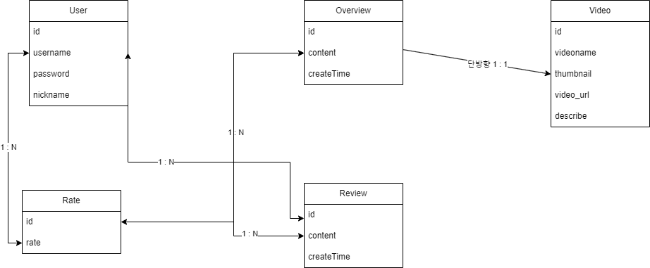

# Netflix_Clone
넷플릭스 클론 코딩 프로젝트입니다. 

## 프로젝스 소개
- **개발 목적:** 개발 연습
- **개발 기간:** 2023.08.19 ~ 2023.08.31(총 12일) -> 2주 정도 생각중입니다.
- **최종 배포:** 2023.XX.XX

## 💻 개발 환경

### Front-End
  

### Back-End
  

### DB

## 데이터베이스 모델 설계

일부 수정이 될 수 있습니다.

## 📌 특이사항
- 변경/수정이 있는 경우 주석 또는 커밋 메시지, `README.md` 작성하기
- 그 외 프로젝트 관련 사항(기획서, 파일 공유 등)은 노션 페이지 프로젝트란에 기록하기
- 노션 페이지 정보 공유 시 확인이 필요한 내용은 슬랙으로 확인 요청하기

 

## 👩🏻‍💻 작업 기록
- `2023.08.20` - TheMovieDB API 연동 완료, 메인 페이지 작성 및 공통부분 분리

 

## 참고 자료
- https://codepen.io/cb2307/pen/XYxyeY -> HTML 디자인